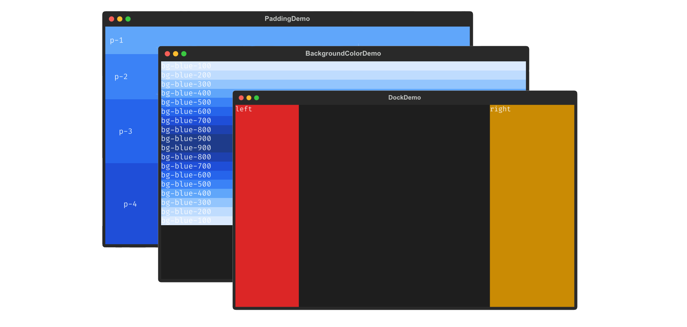

# tuilwindcss

This project is inspired by [tailwind.css](https://tailwindcss.com/) to offers a similar set of classes that can be used directly to construct TUI apps with [Textual](https://textual.textualize.io/). It's an experimental project to see if it makes it easier to construct apps. 



> Please check out tailwind.css if you haven't already. This project is not affiliated or endorsed by tailwind labs, but it's an awesome project.

## Contents 

There are two files generated by this project: `style.css` and `style.min.css`. These contain the relevant classes that mimic the names that tailwind uses.

## Demo Docs

The documentation page gives a visual gallery of all the features of the library.

## Download

To use the CSS file locally, you can easily download it via: 

```
wget https://github.com/koaning/tuilwindcss/blob/main/tuilwind.css
```

You can also pick the minified version if you prefer. 

```
wget https://github.com/koaning/tuilwindcss/blob/main/tuilwind.min.css
```
